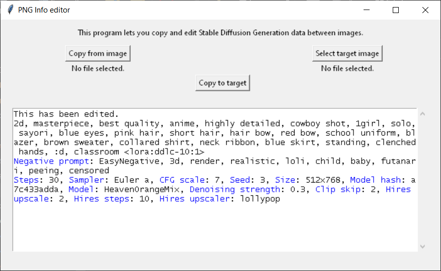

# PNG Info Editor
* Copy PNG Info from an existing image
* Edit it (with some simple syntax highlighting)
* Save it to another image or the same image

Useful for Civitai, sharing on Discord, or messing with people.

### How to use

Download the `.exe` file in the dist folder and enjoy.

Alternatively, download the `.pyw` file and run it with Python.

